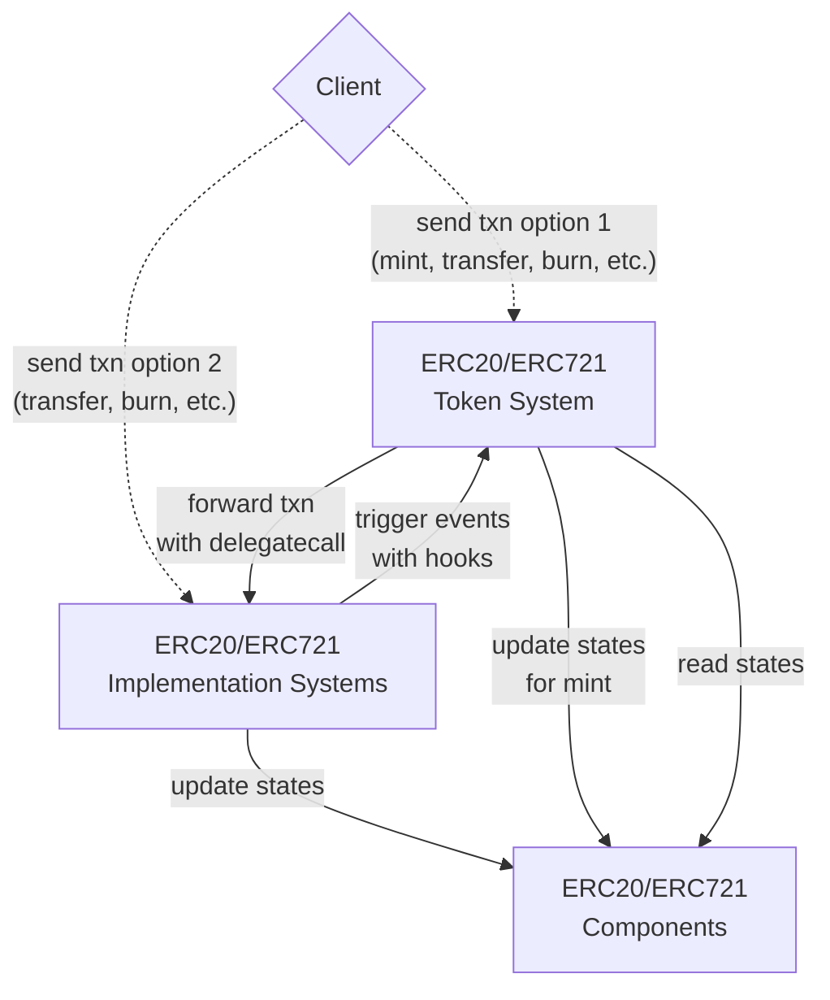

# SECS

ERC20 and ERC721 contracts for the [mud.dev](https://www.mud.dev) ECS system.

# Architecture



The ERC20 and ERC721 token systems are effectively `MintSystem`s which implement the IERC20 and IERC721 interface respectively by delegating the logic to the `TransferFromSystem`, `BurnSystem`, `ApproveSystem`, etc.

To register events back to the token systems, the implementation systems triggers `beforeTokenTransfer`, `afterTokenTransfer`, `afterApproval`, and `afterApprovalForAll` hooks on the token system. These hooks by default will emit the corresponding ERC20/ERC721 events, but can be overridden to add additional logic.

The main advantage of this architecture is that all of the tokens within a world can share the same set of implementation systems and components. To deploy a new token, you would only need to deploy the ERC20/ERC721 token system; the existing implementation systems and components would be reused.

# ERC721 Entity Hash

ERC721 entities are hashed using the following function:

```solidity
function tokenToEntity(address token, uint256 id) pure returns (uint256) {
    return (uint256(uint160(token)) << 96) | id;
}
```

This prevents collisions between tokens from different contracts and can be used to identify the token contract from the entity hash. However, the token id must be < 2^96.
